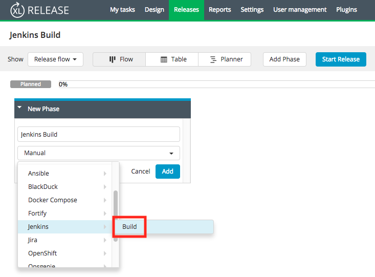
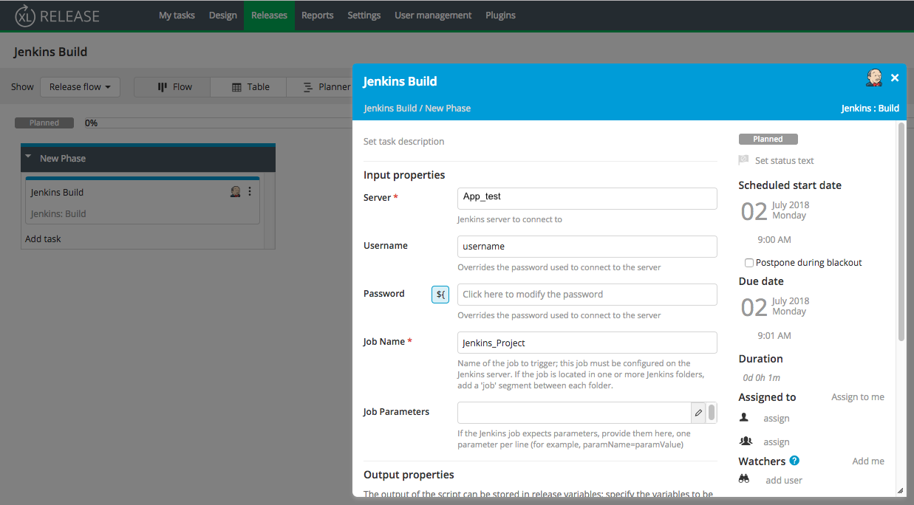

# Triggering a Jenkins build as a task on XebiaLabs

This guide will demonstrate how to set a XebiaLabs task to trigger a Jenkins build. 

## Prerequisites

* Jenkins is installed and you have an account

* Have an account with XebiaLabs

_Follow the steps below to setup XebiaLabs for Jenkins_

#### 1.1 Install the Jenkins plugin

On XebiaLabs, click on 'Plugins' in the navigation bar at the top of the screen. In the search bar, type in 'Jenkins' and install. 

#### 1.2 Update Jenkins plugin settings

In the navigation bar, click on 'Settings' and then 'Shared configuration'. 

Under 'Jenkins: Server', click on 'Add Server'. 

Enter in a title for the configuration, as well as the Jenkins url where the server can be reached. 

Under 'Authentication', enter in your Jenkins username and password. 

#### 1.3 Set Jenkins as a task

If you have not already have a release, create a new one. 

Click on 'Add task' under the desired phase. 

Set a name for the new task. Click on the dropdown menu and select 'Jenkins' and 'Build'. Then click the 'Add' button to finish creating the task. 

Click on the task to open up the settings. Enter in the Server name, which was created earlier. Enter your Jenkins username and password, as well as the name of the job you want to trigger in Jenkins. 

Exit out of the settings and start your release. You have successfully created a task that will trigger a Jenkins build!