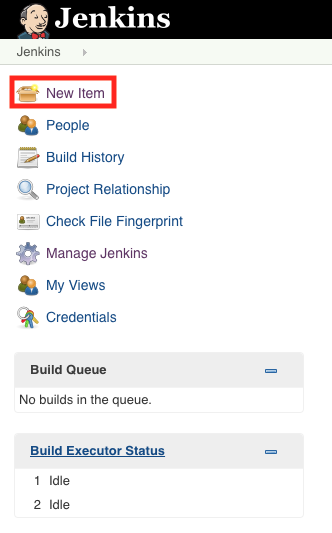
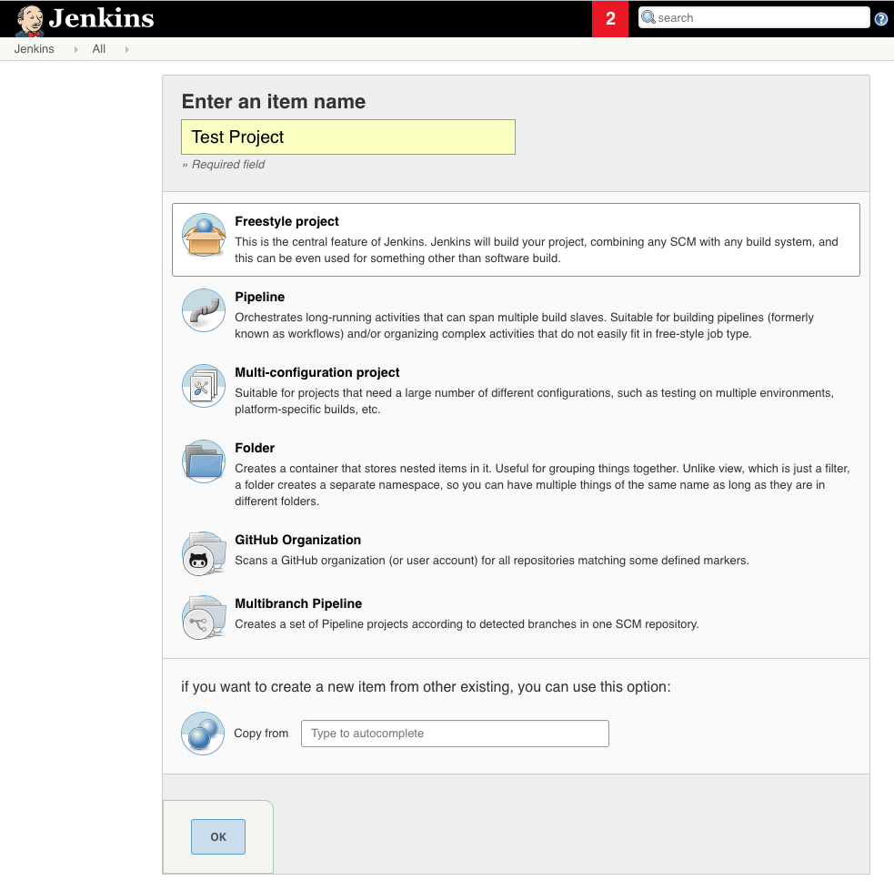
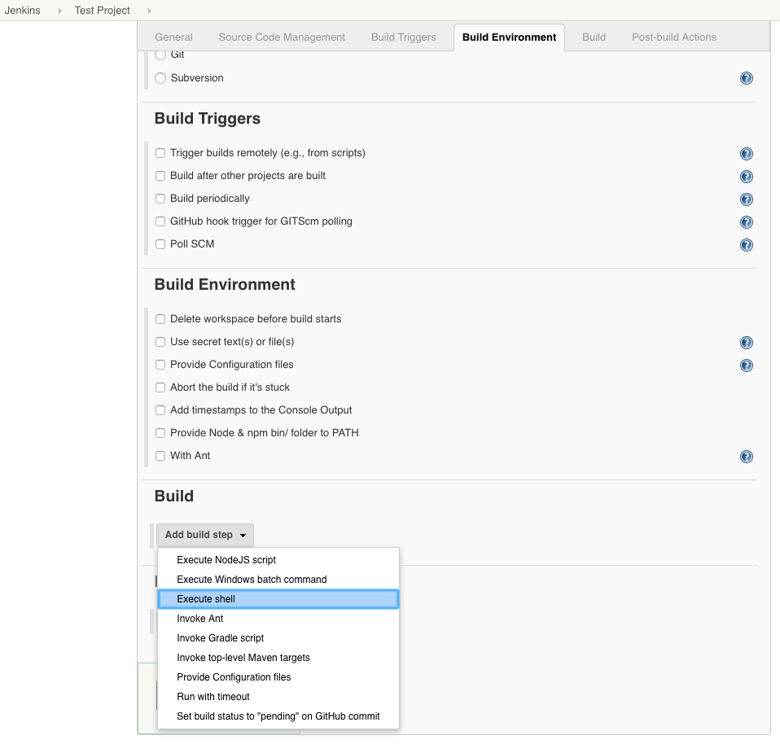
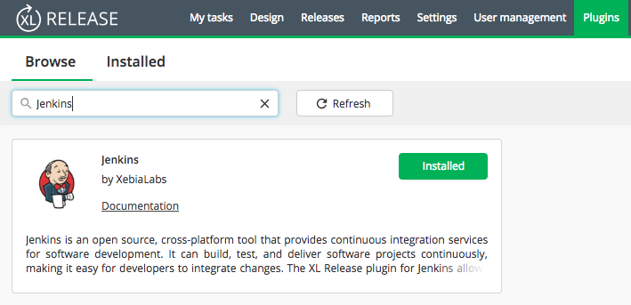
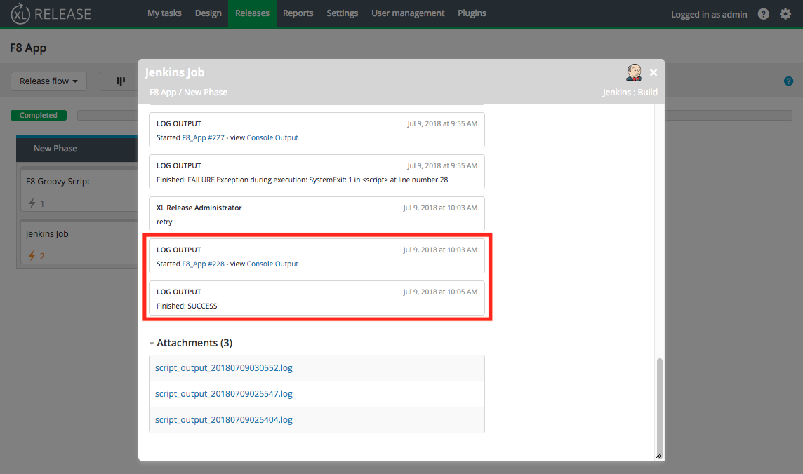

# Triggering a Jenkins build as a task on XebiaLabs

This guide will demonstrate how to set a XebiaLabs task to trigger a Jenkins build. 

## Prerequisites

* Jenkins is installed

* Have an account with XebiaLabs

## Jenkins Configuration

### 1. Integrate NodeJS Plugin

This guide will execute the NodeJS test script from the Kobiton samples for this Jenkins build. To run a NodeJS script, installing the NodeJS Plugin on Jenkins is necessary. 

Add the NodeJS Plugin on Jenkins to execute NodeJS script as a build step. To do this, go to 'Manage Jenkins' -> 'Manage Plugins' -> Available. Search for NodeJS and install it.


> Note: If you are using a different programming language for your automation script, you may try to find a suitable plugin for your project if necessary.

### 2. Create a new Jenkins job

On the left sidebar, click on 'New Item' to create a new project. 



Enter in a project name and select the project type 'Freestyle project'. 



Once you click 'OK', you will automatically be taken to the project's configuration settings. Go the 'Build' section. Click on 'Add build step' and select 'Execute shell'. 



Enter the necessary commands. The below example will execute the android-app-test script sample from Kobiton.

```
#!/bin/bash
[ ! -d "samples" ] && git clone https://github.com/kobiton/samples.git || echo "Samples already exist"
cd samples/javascript
npm install
npm run android-app-test
```

> Note: In your automation test, make sure to include your Kobiton username, API key, and the desired capabilities, which can all be found on the Kobiton website.

Under build environment, check the box that says 'Provide Node & npm bin/ folder to PATH'.


Save your configuration settings. Try 'Build Now' and then check Kobiton cloud devices to see if a test session was created.  

## XebiaLabs Configuration

### 1. Install the Jenkins plugin in XebiaLabs

On XebiaLabs, click on 'Plugins' in the top navigation bar. In the search bar, type in 'Jenkins' and install it. 



### 2. Update Jenkins plugin settings

In the navigation bar, click on 'Settings' and then 'Shared configuration'. 

Under 'Jenkins: Server', click on 'Add Server'. 


Enter in a title for the configuration, as well as the Jenkins url where the server can be reached. 

Under 'Authentication', enter in your Jenkins username and password. 


### 3. Set Jenkins as a task

If you have not created a release yet, follow [this link](./planning-release.md) for guidance on how.

Once your release is created, we will add a task that will trigger a Jenkins build. 

Click on 'Add task' under the desired phase. 


Set a name for the new task. Click on the dropdown menu and select 'Jenkins' and 'Build'. Then click the 'Add' button to finish creating the task. 


Click on the task to open up the settings. Enter in the Server name, which was created earlier. Enter your Jenkins username and password, as well as the name of the job you want to trigger in Jenkins. 


Exit out of the settings and start your release. You have successfully created a task that will trigger a Jenkins build!

Check the log output in your task to see if the build was successful.  

